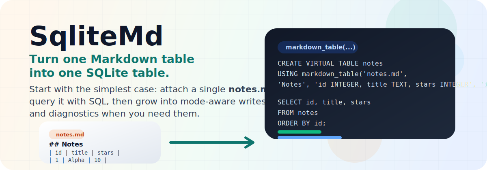

<p align="center">
  
</p>

<h1 align="center">SqliteMd</h1>

<p align="center">
  <strong>Query, scan, and diagnose Markdown tables with SQLite.</strong>
</p>

<p align="center">
  <strong>SqliteMd</strong> is a <a href="https://github.com/SQLite-DNA/SqliteDna">SqliteDna</a> extension that turns Markdown pipe tables into SQLite virtual tables.
  Use it to read and write a single <code>.md</code> file, scan an entire repository of notes as one logical table, and explain exactly why a file was accepted or rejected.
</p>

---

## Why SqliteMd?

Markdown is approachable, durable, diff-friendly, and easy to keep under version control.
SQLite is unmatched when you want structure, filters, joins, aggregation, diagnostics, and repeatable queries.

SqliteMd sits in the middle:

- keep data in ordinary Markdown files
- query that data with real SQL
- write back to a single Markdown-backed table
- scan a whole repository of Markdown files without preprocessing
- diagnose acceptance and rejection with one unified SQL view

This is especially useful for:

- notes and knowledge bases
- changelogs and release notes
- lightweight project tracking
- documentation repositories
- content pipelines that want SQL without abandoning plain text

## Highlights

- `markdown_table(...)` gives you the default `read_write` single-file behavior.
- `markdown_table_mode(...)` adds explicit `read_only` and `append_only` control for single-file tables.
- `markdown_glob(...)` and `markdown_repo(...)` expose a read-only table across many Markdown files.
- Existing files ignore preamble and bind to the first Markdown table found.
- If no table exists in a single-file target, SqliteMd can create one on first write.
- `markdown_diagnostics(...)` explains acceptance and rejection using the same logic the runtime uses.
- The supplied schema is authoritative, which means you can work with duplicate or inconsistent Markdown headers as long as column counts line up.

## Table of Contents

- [Installation](#installation)
- [Quick Start](#quick-start)
- [Mental Model](#mental-model)
- [Function Overview](#function-overview)
- [Single-File Tables](#single-file-tables)
- [Repository Tables](#repository-tables)
- [Diagnostics](#diagnostics)
- [Examples and Recipes](#examples-and-recipes)
- [Limitations and Design Choices](#limitations-and-design-choices)
- [Development](#development)

## Installation

### Requirements

- Windows x64
- `sqlite3.exe` or another SQLite host that supports loadable extensions

The current published build targets `win-x64`.

### Download the extension

Download the latest release asset:

```powershell
Invoke-WebRequest `
  -Uri "https://github.com/SQLite-DNA/SqliteMd/releases/latest/download/SqliteMd.dll" `
  -OutFile SqliteMd.dll
```

### Load it in SQLite

```text
PS> sqlite3 demo.db
sqlite> .load .\SqliteMd.dll
```

Once loaded, SqliteMd surfaces its entry points through `CREATE VIRTUAL TABLE ... USING ...`.

That includes:

- writable virtual tables such as `markdown_table(...)`
- mode-aware virtual tables such as `markdown_table_mode(...)`
- read-only repository scans such as `markdown_glob(...)`
- diagnostics views such as `markdown_diagnostics(...)`

## Quick Start

### Create and write a Markdown-backed table

```sql
CREATE VIRTUAL TABLE notes
USING markdown_table(
  'notes.md',
  'Notes',
  'id INTEGER, title TEXT, stars INTEGER',
  'id'
);

INSERT INTO notes(id, title, stars) VALUES
  (1, 'Release notes', 4),
  (2, 'Testing coverage', 7);

UPDATE notes
SET stars = 10
WHERE id = 2;

SELECT id, title, stars
FROM notes
ORDER BY id;
```

Result:

```text
1|Release notes|4
2|Testing coverage|10
```

The resulting file on disk will look like:

```md
## Notes

| id | title | stars |
| --- | --- | --- |
| 1 | Release notes | 4 |
| 2 | Testing coverage | 10 |
```

If you want to constrain writes, use `markdown_table_mode(...)`:

```sql
CREATE VIRTUAL TABLE notes_ro
USING markdown_table_mode(
  'notes.md',
  'Notes',
  'id INTEGER, title TEXT, stars INTEGER',
  'id',
  'read_only'
);
```

### Query an existing file with preamble

SqliteMd ignores Markdown preamble and binds to the first Markdown table in the file.

```md
# Release Notes

This document has prose before the table.

## Notes

| id | title | stars |
| --- | --- | --- |
| 1 | Release notes | 4 |
| 2 | Testing coverage | 7 |
```

```sql
CREATE VIRTUAL TABLE notes
USING markdown_table(
  'release-notes.md',
  'Ignored For Existing Files',
  'id INTEGER, title TEXT, stars INTEGER',
  'id'
);

SELECT * FROM notes ORDER BY id;
```

### Query a whole repository of Markdown files

```sql
CREATE VIRTUAL TABLE tasks
USING markdown_glob(
  'C:\Notes\**\*.md',
  'id INTEGER, title TEXT, stars INTEGER'
);

SELECT id, title, _path
FROM tasks
WHERE stars >= 10
ORDER BY _path, id;
```

### Diagnose skipped files

```sql
CREATE VIRTUAL TABLE diag
USING markdown_diagnostics(
  'glob',
  'C:\Notes\**\*.md',
  'id INTEGER, title TEXT, stars INTEGER',
  '',
  ''
);

SELECT path, accepted, reason_code, reason_detail
FROM diag
WHERE accepted = 0
ORDER BY path;
```

## Mental Model

SqliteMd is easiest to use if you keep four rules in mind.

### 1. The schema you provide is authoritative

SqliteMd does not infer a SQL schema from Markdown headers.
Instead, you provide the schema explicitly:

```sql
'id INTEGER, title TEXT, stars INTEGER'
```

That schema controls:

- column names exposed to SQLite
- type affinity used for values
- the required column count
- the key-column lookup for writable single-file tables

Markdown headers are treated as layout, not as the source of truth for schema.
This is why SqliteMd can still work with awkward or duplicate Markdown headers if the column count matches.

### 2. Existing files always bind to the first Markdown table

For both single-file and repository-scoped reads:

- preamble is ignored
- the first Markdown table wins
- later tables in the same file are ignored

That keeps the rule simple and predictable.

### 3. `table_title` is creation metadata, not a lookup key

In `markdown_table(...)`, `table_title` is used only when SqliteMd needs to create a new table block.

If the file already contains a Markdown table, SqliteMd:

- ignores `table_title` for selection
- preserves the existing surrounding content
- rewrites only the selected table block

When a new table is created and `table_title` is non-empty, SqliteMd emits:

```md
## <table_title>
```

above the new table.

### 4. Repository scans are read-only

`markdown_glob(...)` and `markdown_repo(...)` are designed for read-heavy workflows:

- aggregation
- reporting
- discovery
- diagnostics

They do not currently support updates back into multiple source files.

## Function Overview

| Function | Scope | Read/write | Typical use |
| --- | --- | --- | --- |
| `markdown_table(path, table_title, schema, key_column)` | One file | Read/write | Maintain a table in a Markdown document |
| `markdown_table_mode(path, table_title, schema, key_column, write_mode)` | One file | Mode-aware | Attach a single file as `read_write`, `read_only`, or `append_only` |
| `markdown_glob(glob_pattern, schema)` | Many files | Read-only | Query the first table across a Markdown tree |
| `markdown_repo(glob_pattern, schema)` | Many files | Read-only | Alias for `markdown_glob(...)` |
| `markdown_diagnostics(mode, target, schema, key_column, table_title)` | One file or many files | Read-only | Explain acceptance, rejection, and capabilities |
| `markdown_diagnostics_mode(mode, target, schema, key_column, table_title, write_mode)` | One file or many files | Read-only | Diagnostics with explicit single-file write-mode input |
| `markdown_table_diagnostics(path, table_title, schema, key_column)` | One file | Read-only | Convenience wrapper for `mode = 'table'` |
| `markdown_table_diagnostics_mode(path, table_title, schema, key_column, write_mode)` | One file | Read-only | Convenience wrapper for mode-aware single-file diagnostics |
| `markdown_glob_diagnostics(glob_pattern, schema)` | Many files | Read-only | Convenience wrapper for `mode = 'glob'` |
| `markdown_repo_diagnostics(glob_pattern, schema)` | Many files | Read-only | Convenience wrapper for `mode = 'repo'` |

## Single-File Tables

### Signature

```sql
CREATE VIRTUAL TABLE t
USING markdown_table(path, table_title, schema, key_column);
```

```sql
CREATE VIRTUAL TABLE t
USING markdown_table_mode(path, table_title, schema, key_column, write_mode);
```

### Parameters

| Parameter | Meaning |
| --- | --- |
| `path` | Markdown file path, path without extension, or directory path |
| `table_title` | Heading used only when creating a new table block |
| `schema` | SQL schema for the exposed columns |
| `key_column` | Column from `schema` used as the SQLite rowid mapping |
| `write_mode` | Optional explicit single-file mode: `read_write`, `read_only`, or `append_only` |

### `path` behavior

- If `path` names a file without an extension, SqliteMd treats it as `<path>.md`.
- If `path` names a directory, SqliteMd creates `<table_title>.md` inside that directory when it needs to create a new file.
- If `path` points to an existing file, SqliteMd reads that file directly.

### `key_column` rules

- It must exist in the supplied schema.
- It must be declared as `INTEGER`.
- On write, `rowid` must match the `key_column` value.

### `write_mode` rules

`markdown_table(...)` is equivalent to:

```sql
markdown_table_mode(path, table_title, schema, key_column, 'read_write')
```

Supported `write_mode` values are:

- `read_write`: default single-file behavior; `INSERT`, `UPDATE`, and `DELETE` are allowed
- `read_only`: reads are allowed; writes are rejected
- `append_only`: reads and `INSERT` are allowed; `UPDATE` and `DELETE` are rejected

Create-on-write depends on the mode:

- `read_write`: if the file or table does not exist yet, first write can create it
- `append_only`: first `INSERT` can create the table block if needed
- `read_only`: no file or table is created; the target opens as an empty relation until content exists

### Semantics

- Reads bind to the first Markdown table in the file.
- Preamble before that table is ignored.
- If no table exists, `read_write` and `append_only` still accept the target for first write.
- In `read_only`, a missing file or missing table opens as an empty relation and never creates content.
- On first write, SqliteMd appends a new table block at the end of the file.
- Only the selected table block is rewritten; surrounding document content is preserved.

### Example: explicit append-only intake

```sql
CREATE VIRTUAL TABLE inbox
USING markdown_table_mode(
  'C:\Docs\weekly-status.md',
  'Weekly Status',
  'id INTEGER, item TEXT, owner TEXT',
  'id',
  'append_only'
);

INSERT INTO inbox(id, item, owner)
VALUES (1, 'Publish docs refresh', 'govert');
```

This lets a Markdown file behave like an append log without allowing in-place updates or deletes.

### Example: create inside a directory

```sql
CREATE VIRTUAL TABLE sprint_board
USING markdown_table(
  'C:\Docs\Sprints\',
  'Sprint Board',
  'id INTEGER, task TEXT, owner TEXT',
  'id'
);
```

If no matching file exists yet, SqliteMd will create:

```text
C:\Docs\Sprints\Sprint Board.md
```

with a `## Sprint Board` heading above the table.

## Repository Tables

### Signatures

```sql
CREATE VIRTUAL TABLE t
USING markdown_glob(glob_pattern, schema);
```

```sql
CREATE VIRTUAL TABLE t
USING markdown_repo(glob_pattern, schema);
```

`markdown_repo(...)` is currently an alias for `markdown_glob(...)`.

### What matches?

`glob_pattern` can be:

- a single file path
- a directory path
- a glob pattern such as `C:\Notes\**\*.md`

Examples:

- `notes.md`
- `C:\Notes`
- `C:\Notes\**\*.md`

### What gets accepted?

For each matched file:

- the first Markdown table is selected
- files with no Markdown table are rejected
- files whose first table has the wrong column count are rejected
- accepted rows are projected into the supplied schema by position

### Hidden provenance columns

Repository tables expose hidden columns you can select explicitly:

| Column | Meaning |
| --- | --- |
| `_path` | Absolute file path for the source Markdown file |
| `_heading` | Heading immediately associated with the selected table, if present |
| `_mtime` | File last-write time as Unix seconds |
| `_table_index` | Index of the selected table inside the file |

Today `_table_index` is always `0` for accepted rows, because SqliteMd always binds to the first table in a file.

### Example: find stale tasks across docs

```sql
CREATE VIRTUAL TABLE tasks
USING markdown_repo(
  'C:\Docs\**\*.md',
  'id INTEGER, title TEXT, status TEXT'
);

SELECT title, status, _path, _mtime
FROM tasks
WHERE status <> 'done'
ORDER BY _mtime ASC, _path ASC;
```

## Diagnostics

Diagnostics are a first-class part of the tool, not an afterthought.

The important design choice is this:

- diagnostics use the same table-selection and acceptance logic as the runtime features
- they are not a separate approximation layer

That means you can ask SqliteMd why something is not working and get an answer that reflects the actual extension behavior.

### Unified diagnostics entry point

```sql
CREATE VIRTUAL TABLE diag
USING markdown_diagnostics(mode, target, schema, key_column, table_title);
```

```sql
CREATE VIRTUAL TABLE diag
USING markdown_diagnostics_mode(mode, target, schema, key_column, table_title, write_mode);
```

`mode` can be:

- `table`
- `glob`
- `repo`

For `mode = 'table'`, `markdown_diagnostics_mode(...)` lets you inspect the exact capabilities that correspond to `read_write`, `read_only`, or `append_only`.

### Convenience wrappers

```sql
CREATE VIRTUAL TABLE diag
USING markdown_table_diagnostics(path, table_title, schema, key_column);
```

```sql
CREATE VIRTUAL TABLE diag
USING markdown_table_diagnostics_mode(path, table_title, schema, key_column, write_mode);
```

```sql
CREATE VIRTUAL TABLE diag
USING markdown_glob_diagnostics(glob_pattern, schema);
```

```sql
CREATE VIRTUAL TABLE diag
USING markdown_repo_diagnostics(glob_pattern, schema);
```

### What diagnostics returns

The diagnostics view is intentionally verbose.
It is meant to answer both:

- "Was this accepted?"
- "Why?"

#### Identity and target columns

| Column | Meaning |
| --- | --- |
| `mode` | `table`, `glob`, or `repo` |
| `target` | The target argument that was passed in |
| `path` | Concrete file path inspected, if applicable |
| `mtime` | Last-write time as Unix seconds, if available |

#### Acceptance columns

| Column | Meaning |
| --- | --- |
| `accepted` | `1` if the target/file is accepted, otherwise `0` |
| `reason_code` | Stable machine-readable explanation |
| `reason_detail` | Human-readable explanation |
| `exists` | Whether the file exists |
| `readable` | Whether the file could be read |

#### Selection columns

| Column | Meaning |
| --- | --- |
| `matched_table_count` | Number of Markdown tables found in the file |
| `selected_table_index` | Index of the table that would be selected |
| `heading` | Associated heading for the selected table |
| `table_start_line` | First line of the selected table block, 1-based |
| `table_end_line` | Line after the table block, expressed as an inclusive end line in diagnostics output |
| `preamble_line_count` | Number of lines before the selected table |

#### Schema and key-column columns

| Column | Meaning |
| --- | --- |
| `schema_column_count` | Number of columns in the supplied schema |
| `detected_column_count` | Number of columns in the selected Markdown table |
| `key_column` | Requested key column for `table` mode |
| `key_column_found` | Whether that key column exists in the schema |
| `key_column_is_integer` | Whether that key column is declared as `INTEGER` |
| `write_mode` | Effective write mode for the inspected target; repo/glob diagnostics report `read_only` |

#### Capability columns

| Column | Meaning |
| --- | --- |
| `can_read` | Reads are valid |
| `can_insert` | Inserts are valid |
| `can_update` | Updates are valid |
| `can_delete` | Deletes are valid |
| `create_on_write` | A table does not exist yet, but first write can create it |

### Reason codes

| Reason code | Meaning |
| --- | --- |
| `ok` | Accepted without qualification |
| `no_markdown_table` | No Markdown table was found in the inspected file |
| `no_markdown_table_create_on_write` | No table exists, but `markdown_table(...)` can create one on first write |
| `missing_file` | The target file does not exist; in `read_only` mode it opens as an empty relation |
| `missing_file_create_on_write` | The target file does not exist, but `markdown_table(...)` can create it on first write |
| `column_count_mismatch` | The first Markdown table exists but does not match the supplied schema width |
| `key_column_not_found` | The requested key column is not present in the supplied schema |
| `key_column_not_integer` | The requested key column is present but not declared as `INTEGER` |
| `file_read_error` | The file could not be read |
| `no_files_matched` | A glob or repo scan matched no files |
| `resolve_target_error` | The input target could not be resolved cleanly |
| `invalid_schema` | The supplied schema is empty or invalid |
| `unsupported_mode` | Diagnostics mode was not one of `table`, `glob`, or `repo` |
| `unsupported_write_mode` | The requested single-file write mode was not recognized |

### Important nuance: accepted does not always mean a table already exists

In `table` mode, the target can be accepted even if the file has no Markdown table yet.

That is why diagnostics can legitimately report:

- `accepted = 1`
- `reason_code = 'no_markdown_table_create_on_write'`

or:

- `accepted = 1`
- `reason_code = 'missing_file_create_on_write'`

The target is valid because SqliteMd knows how to create the table on first write.

In `read_only`, diagnostics can also legitimately report:

- `accepted = 1`
- `reason_code = 'no_markdown_table'`
- `create_on_write = 0`

That means the single-file target is queryable as an empty relation, but read-only mode will not create content.

### Example: inspect a single file target

```sql
CREATE VIRTUAL TABLE diag
USING markdown_table_diagnostics(
  'notes.md',
  'Notes',
  'id INTEGER, title TEXT, stars INTEGER',
  'id'
);

SELECT
  accepted,
  reason_code,
  heading,
  table_start_line,
  create_on_write
FROM diag;
```

### Example: inspect append-only behavior before attaching

```sql
CREATE VIRTUAL TABLE diag
USING markdown_table_diagnostics_mode(
  'drafts\weekly-status.md',
  'Weekly Status',
  'id INTEGER, item TEXT, owner TEXT',
  'id',
  'append_only'
);

SELECT write_mode, accepted, can_insert, can_update, can_delete, create_on_write
FROM diag;
```

### Example: explain why repo files were skipped

```sql
CREATE VIRTUAL TABLE diag
USING markdown_diagnostics(
  'glob',
  'C:\Notes\**\*.md',
  'id INTEGER, title TEXT, stars INTEGER',
  '',
  ''
);

SELECT
  path,
  accepted,
  reason_code,
  reason_detail,
  detected_column_count
FROM diag
WHERE accepted = 0
ORDER BY path;
```

## Examples and Recipes

The repository includes ready-to-run example assets under `examples/`:

- `examples/single-file/release-notes.md`
- `examples/single-file/read-write.sql`
- `examples/single-file/read-only.sql`
- `examples/single-file/append-only.sql`
- `examples/repo/repository-scan.sql`
- `examples/repo/repository-diagnostics.sql`

### Query release notes stored in Markdown

```sql
CREATE VIRTUAL TABLE notes
USING markdown_table(
  'release-notes.md',
  'Release Notes',
  'id INTEGER, title TEXT, stars INTEGER',
  'id'
);

SELECT title
FROM notes
WHERE stars >= 5
ORDER BY stars DESC;
```

The matching sample file is `examples/single-file/release-notes.md`.

### Attach the same file as read-only

```sql
CREATE VIRTUAL TABLE notes_ro
USING markdown_table_mode(
  'examples/single-file/release-notes.md',
  'Release Notes',
  'id INTEGER, title TEXT, stars INTEGER',
  'id',
  'read_only'
);

SELECT id, title, stars
FROM notes_ro
ORDER BY id;
```

### Append to a Markdown file without allowing updates

```sql
CREATE VIRTUAL TABLE weekly_status
USING markdown_table_mode(
  'examples/single-file/append-target.md',
  'Weekly Status',
  'id INTEGER, item TEXT, owner TEXT',
  'id',
  'append_only'
);

INSERT INTO weekly_status(id, item, owner)
VALUES (1, 'Ship docs refresh', 'govert');
```

### Scan a documentation tree for tasks

```sql
CREATE VIRTUAL TABLE tasks
USING markdown_glob(
  'C:\Work\Docs\**\*.md',
  'id INTEGER, title TEXT, owner TEXT, status TEXT'
);

SELECT owner, COUNT(*) AS open_items
FROM tasks
WHERE status <> 'done'
GROUP BY owner
ORDER BY open_items DESC;
```

### See where a row came from

```sql
SELECT id, title, _path, _heading
FROM tasks
ORDER BY _path, id;
```

### Diagnose a schema mismatch

```sql
CREATE VIRTUAL TABLE diag
USING markdown_table_diagnostics(
  'notes.md',
  'Notes',
  'id INTEGER, title TEXT, stars INTEGER',
  'id'
);

SELECT reason_code, reason_detail, detected_column_count
FROM diag;
```

### Use diagnostics to preview whether a target is ready before writing

```sql
CREATE VIRTUAL TABLE diag
USING markdown_table_diagnostics(
  'drafts\weekly-status.md',
  'Weekly Status',
  'id INTEGER, item TEXT, owner TEXT',
  'id'
);

SELECT accepted, create_on_write, can_insert
FROM diag;
```

### Run the bundled repo diagnostics example

```sql
CREATE VIRTUAL TABLE diag
USING markdown_glob_diagnostics(
  'examples/repo/docs/**/*.md',
  'id INTEGER, title TEXT, owner TEXT, status TEXT'
);

SELECT path, accepted, reason_code
FROM diag
ORDER BY path;
```

## Limitations and Design Choices

SqliteMd is intentionally opinionated.

- The current published build targets Windows x64.
- Only Markdown pipe tables are supported.
- Existing files always bind to the first Markdown table.
- `table_title` is not a selector for existing files.
- The supplied schema must match the selected table by column count.
- Single-file mode selection is explicit: default `read_write`, plus `read_only` and `append_only` through `markdown_table_mode(...)`.
- Repository scans are read-only.
- Repository scans ignore files with no table or the wrong column count, but diagnostics can explain why.

These tradeoffs keep the implementation predictable and make the diagnostics trustworthy.

## Development

This repo currently builds against a local checkout of `SQLite-DNA/SqliteDna`.

Expected local layout:

```text
C:\Work\
  SQLite-DNA\
    SqliteMd\
    SqliteDna\
```

### Build

```powershell
dotnet restore
dotnet build SqliteMd\SqliteMd.csproj -c Debug
```

### Test

```powershell
dotnet test SqliteMd.slnx
```

### Notes for contributors

- README examples assume Windows paths because the current project configuration targets `win-x64`.
- The tests use the sibling `SqliteDna` checkout directly.
- When changing acceptance rules, update diagnostics and tests together. Diagnostics are part of the product surface, not just development scaffolding.

## Summary

SqliteMd is for people who want Markdown to stay simple and human-readable, but still want the leverage of SQL.

Use:

- `markdown_table(...)` when one Markdown file should behave like a real table you can update
- `markdown_table_mode(...)` when you want the same single-file model but with `read_only` or `append_only` constraints
- `markdown_glob(...)` / `markdown_repo(...)` when you want one queryable view over many Markdown files
- `markdown_diagnostics(...)` when you want the extension to explain itself clearly

If your data wants to remain in text, but your workflow wants joins, filters, aggregation, and rigor, this is the tool.
